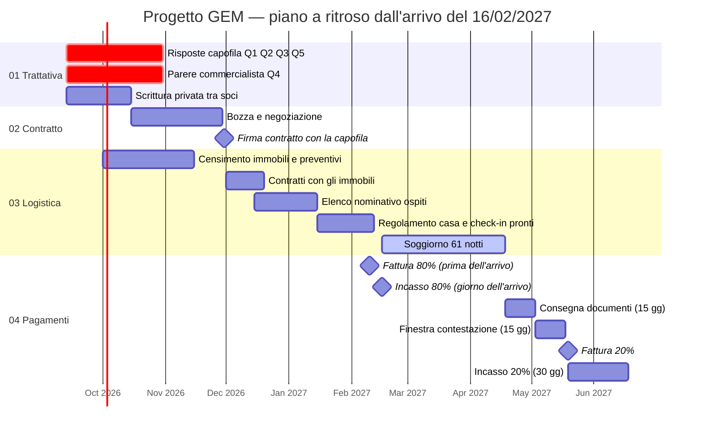

# Progetto GEM — Indice e stato corrente

> **Questo file riflette sempre e solo lo stato più aggiornato del progetto.**
> Non contiene storico: ogni cambiamento sostituisce il valore precedente.
> Lo storico delle decisioni vive in [`05-log-decisioni/`](05-log-decisioni/), quello
> dei movimenti economici nel [registro su Google Fogli](04-pagamenti/movimenti-economici.md).

---

## 1. Identikit del progetto

| Voce | Valore |
|---|---|
| Nome progetto | **GEM** |
| Tipo | Accoglienza **B2B** per ragazzi post-diploma spagnoli, con **collocamento in aziende ospitanti** |
| Capofila | **Inversión y Educación S.L.** (nome commerciale School Travel), Madrid, VAT ESB83018630 valido su VIES; rappresentata da Iñigo Álvarez Valdés |
| Controparte italiana | Gianluca Iaconeta e Luigi Zerulo, soci al 50 % (vedi [`00-anagrafica/soggetti-e-ruoli.md`](00-anagrafica/soggetti-e-ruoli.md)) |
| Firmatario e fatturante | **Gianluca Iaconeta** — chi fattura è da confermare col commercialista (16/09) |
| Durata soggiorno | **61 notti** per ospite (16/02 → 18/04/2027), come nell'unica email scritta di School Travel (25/06/2026). ⚠️ 61 notti = **62 giorni**, formato medio del bando; i 2.000 € sono il tetto del formato da 92: **prezzo da chiedere** |
| Data di arrivo | **16/02/2027** (martedì) — dall'email di School Travel del 25/06/2026; *da confermare per iscritto*. Il precedente 01/03 veniva da un ricordo impreciso |
| Data di partenza | **18/04/2027** (domenica) — 61 notti dopo l'arrivo |
| Numero ospiti | **36** — sono i 42 pianificati da Jaén meno i 6 dirottati su un'altra città a luglio 2026; soggetto a variazione |
| Sistemazione | **Camere singole** |
| Stato complessivo | 🔴 **Trattativa in corso — nessun documento scritto con prezzo, date, penali o pagamenti. Ospitante 2026 (ditta di Luigi) cessata: per il 2027 ospitante e fatturante è l'impresa di Gianluca; contratto da scrivere e proporre** |
| Cartella Drive condivisa | [Progetto GEM](https://drive.google.com/drive/folders/1pi-At6vpQarCtofPGBuuYgX3fke82UGR) — registro movimenti, esempio art. 7, copia di revisione della scrittura privata |
| Casella email di progetto | **garganoeuropemobility@gmail.com** (creata il 18/09/2026) — canale ufficiale verso capofila, proprietari, aziende e commercialista; ha accesso in scrittura alla cartella Drive e al registro |

---

## 2. Stato per fase

| Fase | Cartella | Stato | Prossima azione |
|---|---|---|---|
| 01 · Trattativa | [`01-trattativa/`](01-trattativa/) | 🟡 In corso | Ottenere risposta scritta alle 3 domande aperte |
| 02 · Contratto e fisco | [`02-contratto/`](02-contratto/) | 🔴 Non avviato | Ricevere bozza contrattuale dalla capofila |
| 03 · Logistica | [`03-logistica/`](03-logistica/) | 🟡 In definizione | Censire immobili e raccogliere preventivi entro il 30/11/2026 |
| 04 · Pagamenti | [`04-pagamenti/`](04-pagamenti/) | 🔴 Nessun movimento | Attendere firma per emettere fattura tranche 80% |
| 05 · Log decisioni | [`05-log-decisioni/`](05-log-decisioni/) | 🟢 Attivo | — |
| 06 · Accordo tra soci | [`06-accordo-soci/`](06-accordo-soci/) | 🟡 Bozze da rivedere | I soci leggono, correggono, firmano |

Legenda: 🟢 completato/attivo · 🟡 in corso · 🔴 bloccato o non avviato

---

## 3. Accordo economico corrente

> Condizioni **concordate verbalmente**, non ancora formalizzate per iscritto.
> Dettaglio completo in [`01-trattativa/01-01-condizioni-economiche.md`](01-trattativa/01-01-condizioni-economiche.md).

| Voce | Valore |
|---|---|
| Corrispettivo | **2.000 € per persona** — è il **tetto del bando per 92 giorni** (email School Travel 14/05/2025), citato da Carmen il 25/06/2026 come "the price you quoted us"; **per il formato da 62 giorni il prezzo è da chiedere**; pacchetto: camera singola, appartamento con zona giorno, niente vitto, abbonamento bus, transfer aeroportuali. Netti: IVA inclusa se dovuta, commissioni a carico capofila, voli esclusi |
| Regime IVA | **Reverse charge — art. 7-ter DPR 633/72** (operazione non soggetta a IVA in Italia) |
| Ricavo lordo teorico (36 ospiti) | **72.000 €** |
| Struttura pagamento | **80 / 20** |
| → Tranche 1 (80%) | 57.600 € — all'**arrivo** |
| → Tranche 2 (20%) | 14.400 € — alla **consegna** di valutazioni, certificati e documentazione firmata |
| Costi variabili | Alloggio · Transfert · Mobility (vedi [`04-pagamenti/`](04-pagamenti/)) |
| Margine residuo | Ripartito **50 / 50** tra i due soci |

---

## 4. Questioni aperte / bloccanti

| # | Questione | Verso | Priorità | Stato |
|---|---|---|---|---|
| Q1 | **Identità giuridica della capofila** — ragione sociale, VAT number, sede legale | Capofila | 🔴 Alta | ❓ Aperta |
| Q2 | **Contratto scritto** — il documento ricevuto il 20/09 è un accordo di collaborazione generico tra Gargano Europe Mobility e Inversión y Educación: senza prezzo, date, penali, 80/20. Il contratto B2B **va scritto** | Capofila | 🔴 Alta | ❓ Aperta |
| Q3 | **Penali e forza maggiore** — la penale a scaglioni descritta da Luigi **non è nel documento ricevuto**: va messa per iscritto nel contratto B2B | Capofila | 🔴 Alta | ❓ Aperta |
| Q4 | **7-ter o 7-quater?** — se il servizio è qualificato come alloggio, l'IVA italiana resta dovuta | Commercialista | 🔴 Alta | ❓ Aperta |
| Q5 | **Età degli ospiti** — **confermata la presenza di minorenni** (16/09): servono numero, responsabile, manleva dei genitori o tutori | Capofila | 🔴 Alta | 🟡 Parziale |

Dettaglio e formulazione delle domande: [`01-trattativa/01-02-domande-aperte-capofila.md`](01-trattativa/01-02-domande-aperte-capofila.md)

> **Q4 non era nella lista iniziale ma è emersa impostando l'inquadramento fiscale.**
> L'art. 7-ter regge se il servizio è un'accoglienza complessa; se invece è qualificato
> come prestazione di **alloggio**, si applica l'art. 7-quater e l'IVA resta **italiana**.
> Su 72.000 € la differenza vale circa 7.200 € (10 %) o 15.840 € (22 %) di margine.
> Dettaglio: [`02-contratto/02-02-inquadramento-fiscale.md`](02-contratto/02-02-inquadramento-fiscale.md)

---

## 5. Piano temporale

> Ancoraggio: **arrivo 16/02/2027**, dall'email di School Travel del 25/06/2026 (da confermare). Tutte le altre date sono
> **proposte a ritroso**, non concordate con nessuno. Vanno confermate con la capofila
> (firma, date) e col commercialista (termini di fatturazione).



| Scadenza | Data | Natura |
|---|---|---|
| Risposte capofila (Q1, Q2, Q3, Q5) e parere commercialista (Q4) | 31/10/2026 | Proposta |
| Scrittura privata tra soci firmata | 15/10/2026 | Proposta |
| Immobili censiti con preventivi | 15/11/2026 | Proposta |
| **Firma contratto con la capofila** | **30/11/2026** | Proposta — *nessun impegno con immobili prima di questa data* |
| Contratti con gli immobili firmati | 20/12/2026 | Proposta (prima delle feste) |
| Elenco nominativo ospiti ricevuto | 15/01/2027 | Proposta |
| Fattura 80 % | 10/02/2027 | Proposta (qualche giorno prima dell'arrivo, deciso 16/09) |
| **Arrivo · incasso 80 %** | **16/02/2027** | **Da email School Travel 25/06/2026**, da confermare (incasso il giorno dell'arrivo, deciso 16/09) |
| **Partenza (61 notti)** | **18/04/2027** | Da email School Travel 25/06/2026 |
| Consegna documentazione | 03/05/2027 | Proposta (15 gg, come nel 2026) |
| Termine contestazione capofila | 18/05/2027 | Proposta (15 gg) |
| Fattura 20 % | 19/05/2027 | Proposta |
| Incasso 20 % | entro 18/06/2027 | Proposta (30 gg) |

> **Da fissare nel contratto, prima di ogni altra cosa: il prezzo.** I **2.000 €** sono il **tetto
> del bando per un soggiorno di 92 giorni** (email School Travel 14/05/2025), non un prezzo proposto
> da noi. Il soggiorno 2027 è di 61 notti, **62 giorni**: uno degli altri due formati del bando (32, 62,
> 92). Il prezzo per quel formato va **chiesto a School Travel**; fino ad allora i totali di questo
> README (72.000 €, 57.600 €, 14.400 €) sono provvisori e probabilmente in eccesso. Dettagli in
> [`02-contratto/02-05-accordo-preliminare-school-travel.md`](02-contratto/02-05-accordo-preliminare-school-travel.md).

---

## 6. Mappa della repository

```
.
├── README.md                    ← questo file: stato corrente, sempre aggiornato
├── 00-anagrafica/               Soggetti, ruoli, glossario
├── 01-trattativa/               Condizioni economiche, domande aperte, comunicazioni
├── 02-contratto/                Termini contrattuali, inquadramento fiscale, checklist documenti
├── 03-logistica/                Alloggi, elenco ospiti, transfert e mobility
├── 04-pagamenti/                Piano 80/20, ripartizione soci, link al registro su Google Fogli
├── 05-log-decisioni/            Storico cronologico e immutabile delle decisioni
├── 06-accordo-soci/             Scrittura privata e documento di progetto tra i soci
├── templates/                   Modelli per nuove voci di log e comunicazioni
└── allegati/                    Documenti ricevuti (PDF, scansioni, contratti firmati)
```

---

## 7. Cartella Drive

Struttura concordata il 16/09: una sottocartella per ambito, che rispecchia le fasi della repo.

```
Progetto GEM/
├── 01 · Trattativa/            email e verbali con la capofila
├── 02 · Contratti/             capofila · immobili · fornitori (firmati e bozze)
├── 03 · Logistica/             preventivi, schede immobili, transfert
├── 04 · Pagamenti/             fatture emesse e ricevute, backup mensile del registro
├── 05 · Ospiti/                documenti dei ragazzi — ACCESSO RISTRETTO (dati personali)
└── 06 · Accordo tra soci/      copia di revisione, versione firmata
```

Già esistenti: la cartella radice, `06 · Accordo tra soci`, il registro movimenti e l'esempio art. 7.

## 8. Come circolano le email del progetto

L'account Google collegato a Claude è quello dell'agenzia; la casella ufficiale del progetto è
**garganoeuropemobility@gmail.com**. Modello concordato il 18/09/2026:

1. **In uscita.** Claude prepara l'email e la invia a garganoeuropemobility@gmail.com con l'oggetto nella
   forma `[GEM → destinatario@…] Oggetto reale`; il corpo è già pronto e firmato, gli allegati
   piccoli sono allegati, quelli grandi sono link alla cartella Drive.
2. Gianluca, da garganoeuropemobility, la **inoltra al destinatario** togliendo l'intestazione "Fwd" e le
   righe di servizio, e mette in **Ccn** l'indirizzo dell'agenzia: così Claude vede cosa è
   partito, a chi e quando, e lo registra nello storico delle comunicazioni.
3. **In entrata.** garganoeuropemobility **inoltra automaticamente** tutto all'indirizzo dell'agenzia
   (Impostazioni Gmail → Inoltro). Claude legge le risposte, le etichetta "GEM" e le registra.
4. **Drive.** Tutti i file del progetto stanno nella cartella "Progetto GEM", condivisa in
   scrittura con garganoeuropemobility: i due account vedono le stesse cose.
5. **Calendario.** Il calendario "GEM" vive sull'account garganoeuropemobility, condiviso con l'agenzia
   con permesso di modifica.

## 9. Come si aggiorna questa repo

1. **Ogni fase si aggiorna in modo indipendente** — modifica solo i file della cartella interessata.
2. **Ogni decisione presa** genera un nuovo file in `05-log-decisioni/` (mai modificare i log passati).
3. **Ogni movimento di denaro** va registrato a mano nel [registro su Google Fogli](04-pagamenti/movimenti-economici.md).
4. **Al termine di ogni modifica**, aggiorna le tabelle di stato di questo README (sezioni 2, 3, 4).
5. Commit con messaggio esplicito: `docs(03-logistica): conferma 36 camere singole`.

---

*Ultimo aggiornamento: 2026-09-13*
