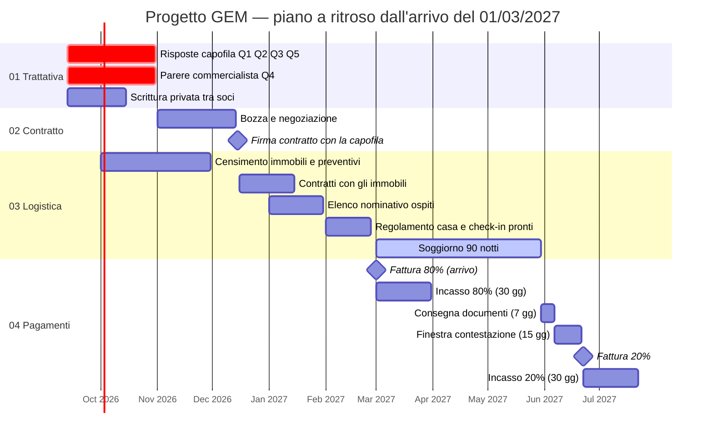

# Progetto GEM — Indice e stato corrente

> **Questo file riflette sempre e solo lo stato più aggiornato del progetto.**
> Non contiene storico: ogni cambiamento sostituisce il valore precedente.
> Lo storico delle decisioni vive in [`05-log-decisioni/`](05-log-decisioni/), quello
> dei movimenti economici in [`04-pagamenti/movimenti-economici.xlsx`](04-pagamenti/movimenti-economici.xlsx).

---

## 1. Identikit del progetto

| Voce | Valore |
|---|---|
| Nome progetto | **GEM** |
| Tipo | Accoglienza **B2B** per ragazzi post-diploma spagnoli |
| Capofila | Soggetto spagnolo — *identità giuridica da confermare* ⚠️ |
| Controparte italiana | Gianluca Iaconeta e Luigi Zerulo, soci al 50 % (vedi [`00-anagrafica/soggetti-e-ruoli.md`](00-anagrafica/soggetti-e-ruoli.md)) |
| Firmatario e fatturante | **L'utente** — *nome da confermare tra i due soci* |
| Durata soggiorno | **90 notti** per ospite |
| Data di arrivo | **01/03/2027** (lunedì) — impostata dal firmatario, *da confermare con la capofila* |
| Data di partenza | **30/05/2027** (domenica) — 90 notti dopo l'arrivo |
| Numero ospiti | **36** (dato corrente, soggetto a variazione) |
| Sistemazione | **Camere singole** |
| Stato complessivo | 🟡 **Trattativa in corso — nessun contratto scritto** |

---

## 2. Stato per fase

| Fase | Cartella | Stato | Prossima azione |
|---|---|---|---|
| 01 · Trattativa | [`01-trattativa/`](01-trattativa/) | 🟡 In corso | Ottenere risposta scritta alle 3 domande aperte |
| 02 · Contratto e fisco | [`02-contratto/`](02-contratto/) | 🔴 Non avviato | Ricevere bozza contrattuale dalla capofila |
| 03 · Logistica | [`03-logistica/`](03-logistica/) | 🟡 In definizione | Censire immobili e raccogliere preventivi entro il 30/11/2026 |
| 04 · Pagamenti | [`04-pagamenti/`](04-pagamenti/) | 🔴 Nessun movimento | Attendere firma per emettere fattura tranche 80% |
| 05 · Log decisioni | [`05-log-decisioni/`](05-log-decisioni/) | 🟢 Attivo | — |

Legenda: 🟢 completato/attivo · 🟡 in corso · 🔴 bloccato o non avviato

---

## 3. Accordo economico corrente

> Condizioni **concordate verbalmente**, non ancora formalizzate per iscritto.
> Dettaglio completo in [`01-trattativa/01-01-condizioni-economiche.md`](01-trattativa/01-01-condizioni-economiche.md).

| Voce | Valore |
|---|---|
| Corrispettivo | **2.000 € netti per persona / 90 giorni** |
| Regime IVA | **Reverse charge — art. 7-ter DPR 633/72** (operazione non soggetta a IVA in Italia) |
| Ricavo lordo teorico (36 ospiti) | **72.000 €** |
| Struttura pagamento | **80 / 20** |
| → Tranche 1 (80%) | 57.600 € — all'**arrivo** |
| → Tranche 2 (20%) | 14.400 € — alla **partenza**, *subordinata a controllo documentale* |
| Costi variabili | Alloggio · Transfert · Mobility (vedi [`04-pagamenti/`](04-pagamenti/)) |
| Margine residuo | Ripartito **50 / 50** tra i due soci |

---

## 4. Questioni aperte / bloccanti

| # | Questione | Verso | Priorità | Stato |
|---|---|---|---|---|
| Q1 | **Identità giuridica della capofila** — ragione sociale, VAT number, sede legale | Capofila | 🔴 Alta | ❓ Aperta |
| Q2 | **Contratto scritto** — chi redige, quale legge applicabile, quale foro | Capofila | 🔴 Alta | ❓ Aperta |
| Q3 | **Penali e forza maggiore** — cancellazioni, no-show, riduzione numero ospiti | Capofila | 🔴 Alta | ❓ Aperta |
| Q4 | **7-ter o 7-quater?** — se il servizio è qualificato come alloggio, l'IVA italiana resta dovuta | Commercialista | 🔴 Alta | ❓ Aperta |
| Q5 | **Età degli ospiti** — "post-diploma" può includere minorenni: cambia consensi, responsabilità e chi firma | Capofila | 🔴 Alta | ❓ Aperta |

Dettaglio e formulazione delle domande: [`01-trattativa/01-02-domande-aperte-capofila.md`](01-trattativa/01-02-domande-aperte-capofila.md)

> **Q4 non era nella lista iniziale ma è emersa impostando l'inquadramento fiscale.**
> L'art. 7-ter regge se il servizio è un'accoglienza complessa; se invece è qualificato
> come prestazione di **alloggio**, si applica l'art. 7-quater e l'IVA resta **italiana**.
> Su 72.000 € la differenza vale circa 7.200 € (10 %) o 15.840 € (22 %) di margine.
> Dettaglio: [`02-contratto/02-02-inquadramento-fiscale.md`](02-contratto/02-02-inquadramento-fiscale.md)

---

## 5. Piano temporale

> Ancoraggio: **arrivo 01/03/2027**, impostato dal firmatario. Tutte le altre date sono
> **proposte a ritroso**, non concordate con nessuno. Vanno confermate con la capofila
> (firma, date) e col commercialista (termini di fatturazione).



| Scadenza | Data | Natura |
|---|---|---|
| Risposte capofila (Q1, Q2, Q3, Q5) e parere commercialista (Q4) | 31/10/2026 | Proposta |
| Scrittura privata tra soci firmata | 15/10/2026 | Proposta |
| Immobili censiti con preventivi | 30/11/2026 | Proposta |
| **Firma contratto con la capofila** | **15/12/2026** | Proposta — *nessun impegno con immobili prima di questa data* |
| Contratti con gli immobili firmati | 15/01/2027 | Proposta |
| Elenco nominativo ospiti ricevuto | 31/01/2027 | Proposta |
| **Arrivo · fattura 80 %** | **01/03/2027** | **Impostata** |
| **Partenza (90 notti)** | **30/05/2027** | Derivata |
| Consegna documentazione | 06/06/2027 | Proposta (7 gg) |
| Termine contestazione capofila | 21/06/2027 | Proposta (15 gg) |
| Fattura 20 % | 22/06/2027 | Proposta |
| Incasso 20 % | entro 22/07/2027 | Proposta (30 gg) |

> **Convenzione da fissare nel contratto:** "90 giorni" qui è letto come **90 notti**
> (check-in 01/03, check-out 30/05). Se la capofila intende 90 giorni di calendario
> inclusi, la partenza slitta o anticipa di un giorno — e con essa il costo di 36 notti.

---

## 6. Mappa della repository

```
.
├── README.md                    ← questo file: stato corrente, sempre aggiornato
├── 00-anagrafica/               Soggetti, ruoli, glossario
├── 01-trattativa/               Condizioni economiche, domande aperte, comunicazioni
├── 02-contratto/                Termini contrattuali, inquadramento fiscale, checklist documenti
├── 03-logistica/                Alloggi, elenco ospiti, transfert e mobility
├── 04-pagamenti/                Piano 80/20, ripartizione soci, movimenti-economici.xlsx
├── 05-log-decisioni/            Storico cronologico e immutabile delle decisioni
├── templates/                   Modelli per nuove voci di log e comunicazioni
└── allegati/                    Documenti ricevuti (PDF, scansioni, contratti firmati)
```

---

## 7. Come si aggiorna questa repo

1. **Ogni fase si aggiorna in modo indipendente** — modifica solo i file della cartella interessata.
2. **Ogni decisione presa** genera un nuovo file in `05-log-decisioni/` (mai modificare i log passati).
3. **Ogni movimento di denaro** va registrato a mano in `04-pagamenti/movimenti-economici.xlsx`.
4. **Al termine di ogni modifica**, aggiorna le tabelle di stato di questo README (sezioni 2, 3, 4).
5. Commit con messaggio esplicito: `docs(03-logistica): conferma 36 camere singole`.

---

*Ultimo aggiornamento: 2026-09-13*
